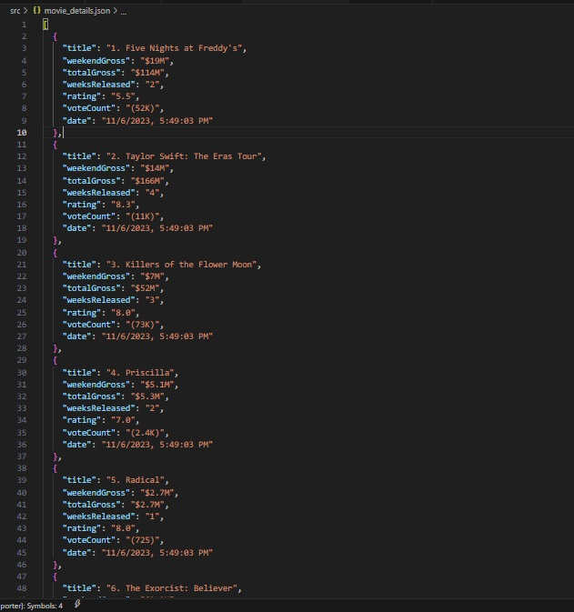

# NIMOTA - DATA SCRAPING TEST

A Node.js script using Puppeteer to scrape IMDb for a list of movies and generate an array of movie objects with specific details.

## Requirements

- NodeJS runtime
- NPM or Yarn package manager

## Features

- Completely written in [Typescript](https://typescriptlang.org/)
- [Puppeteer](https://pptr.dev/) Nodejs library

## How to run

- Clone the repository
- `git clone git@github.com:OjerIsaac/Nimota.git`
- `cd Nimota`
- Install dependencies
- `yarn install`
- Run build
- `yarn run build`
- Run script
- `npm start`
- Result of crawled sites are logged as json file
- Errors are logged in the `error.txt` file

## Attachments

  

## Issues

Should you have issues setting up or code improvement, please open a PR or reach out to the developer [isaacojerumu@gmail.com](mailto:isaacojerumu@gmail.com)
